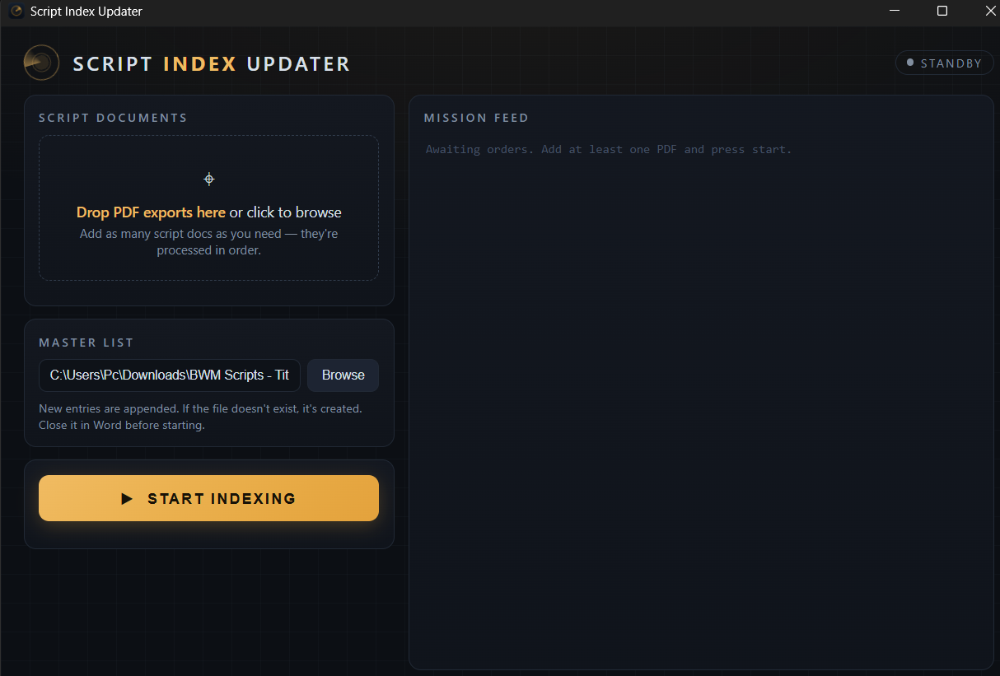
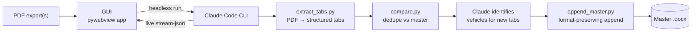

<div align="center">
  
  <h1>Script Index Updater</h1>
</div>

> Turn a Google Docs tab-export PDF of video scripts into a clean, deduplicated Word index — automatically.


**🌐 Website: [script-index-updater.vercel.app](https://script-index-updater.vercel.app)**

Managing a YouTube channel with a Google Doc holding **90+ script tabs** means one recurring chore: keeping a master index of every video title and its featured subject. This tool automates the entire pipeline — drop in one or more PDF exports, and it extracts every script tab, identifies the vehicle each script is about (even when it isn't labelled), and appends **only the new entries** to a formatted Word master list.

<div align="center">
  
</div>

## Features

- **Mission-control GUI** — dark, modern desktop app (Edge WebView2). Drag & drop any number of PDFs, watch a live feed of the indexing run, get a rendered mission report at the end.
- **AI-powered subject identification** — scripts without an explicit `Vehicle in Context:` label are read and classified by [Claude Code](https://claude.com/claude-code) running headlessly. No API key required; it uses your existing Claude Code installation.
- **True incremental updates** — entries are matched against the master list by normalized title (with fuzzy near-miss review), so re-running on an updated export only appends what's new. Your existing rows are never touched or regenerated.
- **Multi-document runs** — queue several PDFs; each is processed in order and deduplicated against entries appended from the previous ones.
- **Export-quirk handling** — detects and recovers from Google Docs export defects: dropped tab-marker pages (two scripts merged into one segment), tab numbering gaps, malformed titles, and non-script tabs (notes/brainstorms).
- **Format-preserving appends** — new table rows are cloned from existing ones, so fonts, borders, shading, and column widths stay exactly as designed. A bundled template bootstraps brand-new master files.

## How it works



The deterministic steps (parsing, deduplication, document surgery) are plain Python for speed and reliability. The one step that genuinely needs intelligence — *"which vehicle is this 4,000-word script actually about?"* — is delegated to Claude, orchestrated by the [`SKILL.md`](SKILL.md) playbook.

## Repository layout

```
├── SKILL.md                  # Claude Code skill: the orchestration playbook
├── scripts/
│   ├── extract_tabs.py       # PDF → JSON (tab, title, vehicle label, snippet) + anomaly report
│   ├── compare.py            # Buckets tabs: matched / uncertain / new vs the master list
│   └── append_master.py      # Appends rows to the .docx, cloning formatting from existing rows
├── assets/
│   └── master_template.docx  # Styled starter document for brand-new master lists
├── gui/
│   ├── app.py                # Desktop app backend (pywebview + headless Claude Code)
│   └── index.html            # The UI — single-file HTML/CSS/JS, zero frameworks
└── launcher.bat              # Double-click to launch; drag PDFs onto it to pre-load them
```

## Requirements

| Requirement | Notes |
|---|---|
| Windows 10/11 | Uses Edge WebView2 (preinstalled on Windows 11) |
| Python 3.10+ | With `pip` |
| [Claude Code](https://claude.com/claude-code) | The `claude` CLI must be on `PATH` (sign in once) |

## Installation

```powershell
git clone https://github.com/TalhaHamdees/script-index-updater.git
cd script-index-updater
pip install -r requirements.txt
```

Optionally, send `launcher.bat` to your desktop as a shortcut.

## Usage

### Desktop app

1. Double-click `launcher.bat` (or drag PDFs straight onto it).
2. Drop your script PDF export(s) into the drop zone.
3. Confirm the master list path — created automatically if it doesn't exist.
4. **START INDEXING** and watch the mission feed. A run over a large export takes a few minutes; most of that is Claude reading scripts to identify subjects.
5. Review the mission report, then *Open master list*.

### As a Claude Code skill

Copy (or symlink) this folder to `%USERPROFILE%\.claude\skills\index-scripts`, then in any Claude Code session:

```
/index-scripts C:\path\to\Scripts.pdf
```

or simply: *"add the new scripts from this PDF to my master list."*

### Expected input

A PDF exported from a Google Doc that uses **document tabs**, where each tab holds one script: the title on the first line, an optional `Vehicle in Context:` label, then the script body. Export via **File → Download → PDF** in Google Docs.

## Configuration

`gui/config.json` (created automatically, not tracked by git) remembers the last-used master list path:

```json
{ "master": "C:\\path\\to\\Master Index.docx" }
```

## License

[MIT](LICENSE) — do what you like, attribution appreciated.
